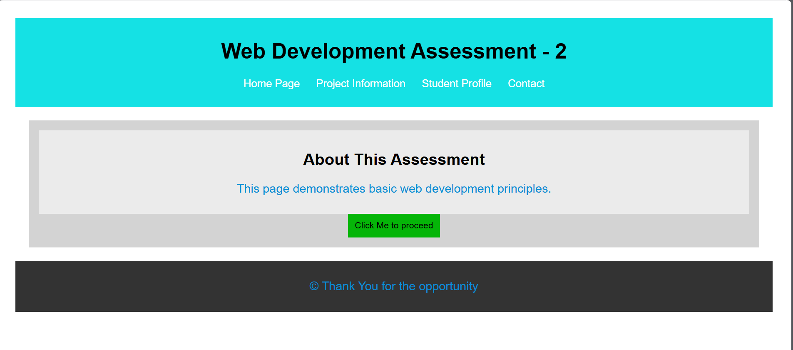

# TSX Unstop Web Development Assessment

## Overview
This project is part of Web Development Assessment 2. It demonstrates:
- HTML structure
- Basic CSS styling
- JavaScript for interactivity

## Features
- A well-structured HTML page with semantic elements
- Styled components for improved readability
- A button that triggers an alert on click
- Console logging for debugging

## How to Run
1. Open `index.html` in a browser.
2. Click the **button** to see an alert pop up.
3. Open the **browser console** to see the log message.

## Technologies Used
- HTML5
- CSS3
- JavaScript

## GitHub Repository
[Project Link](https://github.com/akshaybhat0/TSX-Unstop-Web-Development)

##Output That Getting

---
